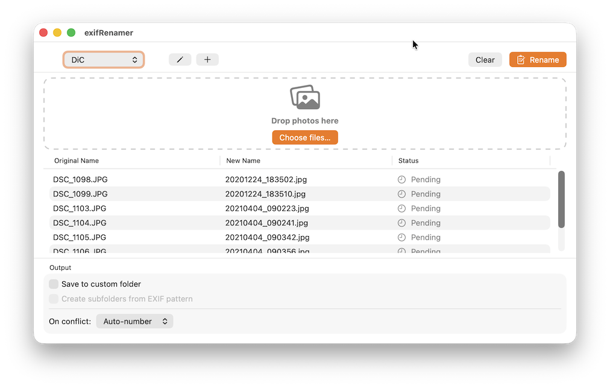

# exifRenamer

exifRenamer is a native macOS app for renaming and organising photo files based on their EXIF metadata. Drop in a batch of photos, pick or build a naming style from a flexible token system, and watch a live preview of every new filename before anything is renamed — with optional automatic sorting into date-based folder structures and configurable handling of naming conflicts.

---

## Screenshots



---

## Features

- **Drag & Drop** – Drop images directly into the window or select them via the open-file dialog
- **EXIF-based renaming** – Date, time, camera make/model, lens, ISO and more as parts of the filename
- **Format-string system** – Flexible token system for custom naming schemes
- **Live preview** – New filename is shown immediately before any files are renamed
- **Preset management** – Save, edit, and reuse multiple naming styles
- **Folder organisation** – Automatically create subfolders based on date patterns (e.g. `2024/2024-06-15`)
- **Conflict handling** – Configurable strategy for filename collisions: Skip, Overwrite, or Auto-number
- **Copy or Move** – Rename in place or copy to a destination folder
- **macOS Sandbox-compliant** – Security-Scoped Bookmarks for safe file access

---

## Requirements

| Requirement | Version |
|---|---|
| macOS | 14 Sonoma or later |
| Architecture | Apple Silicon only |
| Xcode | 15 or later |
| Swift | 5.9 or later |

---

## Installation

### Build from source

```bash
git clone https://github.com/dirkclemens/exifRenamer.git
cd exifRenamer
open exifRenamer.xcodeproj
```

In Xcode, set the **Scheme** to `exifRenamer`, select your Mac as the target, and press **⌘R**.

> An Apple Developer account is not required for local builds (an unsigned build is sufficient for your own Mac).

### Prebuilt DMG

A ready-to-run build is available as `exifRenamer.dmg` (ad-hoc signed, Apple Silicon only). Since it isn't notarized by Apple, macOS blocks it on first launch. Remove the quarantine flag before opening:

```bash
xattr -dr com.apple.quarantine /Applications/exifRenamer.app
```

Alternatively, right-click the app in Finder and choose "Open".

---

## Usage

### Format Tokens

Naming styles are defined as format strings with placeholders:

| Token | Meaning | Example |
|---|---|---|
| `%Y` | Year (4-digit) | `2024` |
| `%M` | Month (2-digit) | `06` |
| `%D` | Day (2-digit) | `15` |
| `%h` | Hour (24h) | `14` |
| `%m` | Minute | `30` |
| `%s` | Second | `05` |
| `%C` | Counter on duplicates | `_01` |
| `%F` | File extension (without dot) | `jpg` |
| `%make` | Camera make | `Canon` |
| `%model` | Camera model | `EOS_R5` |
| `%iso` | ISO value | `800` |
| `%lens` | Lens model | `RF24-70mm_F2.8_L` |

> `%C` is only inserted when filename collisions are detected within the current batch.

#### Built-in Example Styles

| Name | Format String | Example Result |
|---|---|---|
| Date+Time | `%Y%M%D_%h%m%s%C.%F` | `20240615_143005.jpg` |
| Date only | `%Y-%M-%D%C.%F` | `2024-06-15.jpg` |
| Camera+Date | `%make_%model_%Y%M%D_%h%m%s%C.%F` | `Canon_EOS_R5_20240615_143005.jpg` |

### Folder Organisation

The optional **Folder Pattern** field in a style automatically creates subfolders using the same tokens:

```
%Y/%Y-%M-%D   →  2024/2024-06-15/
%Y/%M         →  2024/06/
```

### Conflict Handling

When a file with the same name already exists at the destination, the configured strategy applies:

| Strategy | Behaviour |
|---|---|
| **Skip** | File is skipped, status shows `⏭ skipped` |
| **Overwrite** | Existing file is replaced |
| **Auto-number** | A counter is appended: `_1`, `_2`, … |

The default strategy can be set in **Settings (⌘,)**.

---

## Project Structure

```
exifRenamer/
├── exifRenamerApp.swift        # App entry point, Settings scene
├── ContentView.swift           # Main layout
├── Models/
│   ├── Photo.swift             # Photo object with EXIF data + status
│   ├── NamingStyle.swift       # Naming preset model
│   ├── FormatToken.swift       # Token enum with descriptions
│   └── RenameResult.swift      # Result enum (.success/.skipped/.failed)
├── ViewModels/
│   └── AppViewModel.swift      # @Observable main view model
├── Services/
│   ├── EXIFReader.swift        # EXIF extraction via ImageIO
│   ├── FormatEngine.swift      # Token substitution + preview
│   ├── StyleStore.swift        # Style persistence (JSON)
│   ├── RenameService.swift     # Rename/copy logic
│   ├── FolderOrganizer.swift   # Subfolder creation
│   ├── FolderAccessManager.swift # Sandbox access management
│   └── DebugLog.swift          # Internal logging
└── Views/
    ├── DropZoneView.swift       # Drag & drop target area
    ├── PhotoListView.swift      # Table: original name → new name
    ├── StyleSelectorView.swift  # Preset picker
    ├── StyleEditorView.swift    # Preset editor (sheet)
    ├── OutputOptionsView.swift  # Destination folder + options
    ├── ErrorBannerView.swift    # Inline error display
    └── SettingsView.swift       # App preferences
```

### Technical Details

- **Framework:** SwiftUI
- **Architecture:** MVVM with the `@Observable` macro (Swift 5.9 / macOS 14+)
- **EXIF reading:** Apple `ImageIO` framework (`CGImageSource`)
- **Date fallback:** Uses the file modification date when no EXIF date is available
- **Sandbox:** `com.apple.security.files.user-selected.read-write` with Security-Scoped Bookmarks
- **Preset storage:** `~/Library/Application Support/exifRenamer/styles.json`

---

## Contributing

Pull requests are welcome! Please open an issue first to discuss any significant changes.

1. Fork the repository
2. Create a feature branch: `git checkout -b feature/my-feature`
3. Commit your changes: `git commit -m 'Add: my feature'`
4. Push the branch: `git push origin feature/my-feature`
5. Open a Pull Request

---

## License

This project is licensed under the [PolyForm Noncommercial License 1.0.0](https://polyformproject.org/licenses/noncommercial/1.0.0) — see [LICENSE](LICENSE) for details. Free for noncommercial use; commercial use requires a separate license from the author.

## Author

Developed by **Dirk Clemens** – feedback and ideas are welcome as a [GitHub Issue](https://github.com/dirkclemens/exifRenamer/issues).
